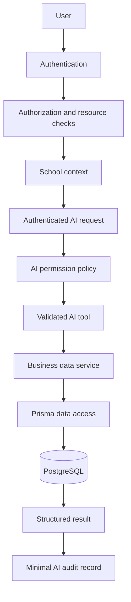

# Nuvora AI readiness

This document describes the security boundary for a future Ask Nuvora experience. No LLM or AI provider is connected.

## Architecture

## Authentication

`protect` verifies the JWT, resolves the current user globally, and establishes the request school context. Bearer tokens are preferred; the legacy cookie fallback remains for compatibility. Passwords are hashed by the existing password utilities. Production error responses no longer return 5xx exception messages or details.

The existing code references `User.selectedSchoolId`, which is now represented in Prisma and has a forward-only migration. Apply that migration before relying on persisted super-admin school selection.

## Authorization

`User.role` remains the compatibility role source for existing route middleware. `Role`, `Permission`, and `RolePermission` are consulted by `hasPermission` when a user has a role assignment. `utils/authorization.js` centralizes authentication, role, school, student, and financial checks. Authentication, authorization, and tenant context remain separate concerns.

## School isolation

Tenant-aware Prisma writes force `schoolId` to the active context and reject nested school relation writes. Parent child discovery, child hubs, parent fees, access-code linking, and academic update/delete operations perform explicit school checks. Resource lookups should use `findFirst` with `schoolId` for tenant-owned records; `findUnique` is reserved for globally unique identity lookups or webhook flows that derive the school from the record.

A super-admin request may establish an active school only through an active school context. The `x-school-id` header is not accepted as a substitute for authentication. Persisted selection must be migrated and selected through `/api/auth/select-school`; direct arbitrary school headers should not be used by clients.

## Resource-level access

Parents and guardians can access only linked children in their school. Students can access only their own student record. Teachers are limited by existing assignment checks in teacher services. Principals and super-admins retain broader school-scoped access through existing route permissions.

## Service/data boundary

Future AI code must call `ai/aiTools.js`, never Prisma. The registry currently exposes only structured tools backed by `services/aiDataService.js`:

- `school.overview`
- `attendance.summary`
- `student.attendance`
- `student.results`
- `fees.outstanding`

There is no raw query tool, SQL input, arbitrary Prisma selector, or LLM SDK.

## AI permissions

`ai/aiPermissions.js` applies a least-privilege role allowlist and honors stored `Permission` records when a user has `roleId`. Parent and student tools require a student scope and pass through resource authorization. School-wide attendance and finance are not available to parent, guardian, teacher, or student roles.

## Audit logging

`ai/aiAudit.js` provides `logAIActivity`. It stores only user, school, action, tool, resource scope, success, and duration metadata in the existing `ActivityLog` model. It does not persist questions, passwords, tokens, payment credentials, or arbitrary request bodies.

## Financial-data safety

Parent fee summaries are calculated for the selected child. School-wide financial totals remain restricted to administrative contexts. Financial balances and percentages are calculated by backend code; a future model may explain structured results but must not calculate authoritative balances.

## Current endpoint

`POST /api/ai/query` is protected by authentication and returns `503 AI service is not configured`. It must remain disabled until a reviewed provider integration, request limits, prompt/data policy, and expanded test suite are approved.

## Follow-up before enabling Ask Nuvora

1. Apply and verify the selected-school migration.
2. Add persistent super-admin school grants if super-admin access must be narrower than all active schools.
3. Add integration tests against two schools and representative parent, student, teacher, and principal accounts.
4. Add request rate limiting and an allowlisted AI request schema.
5. Connect an AI provider only behind a feature flag and keep tool execution server-authoritative.
